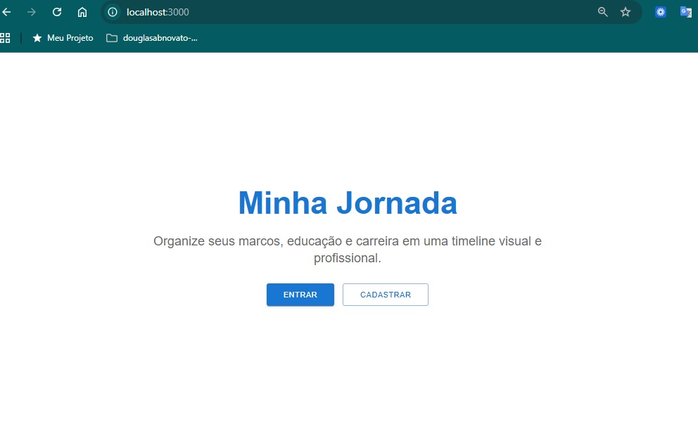
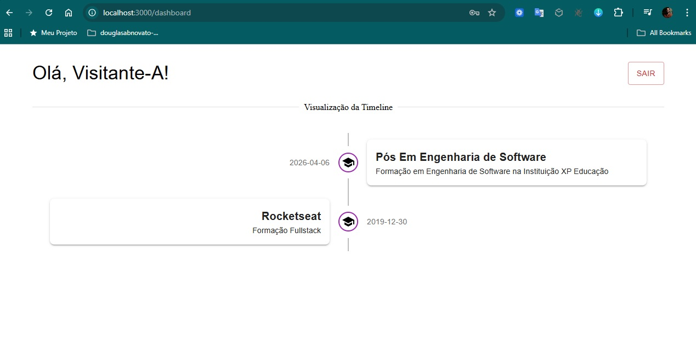
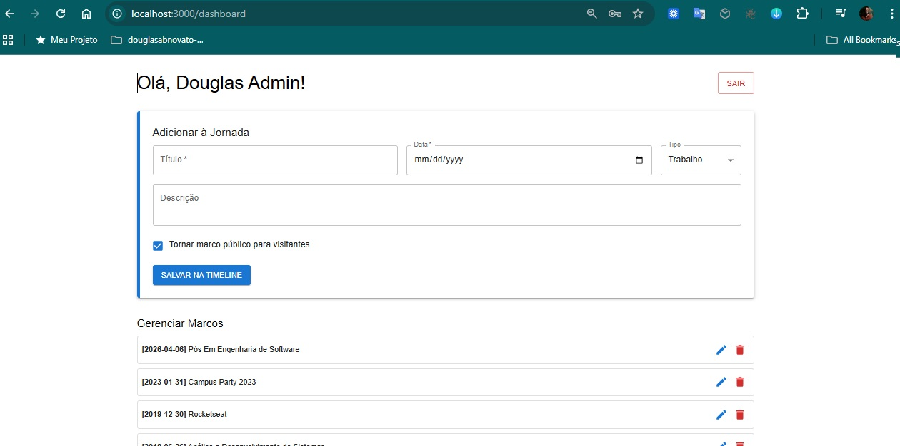
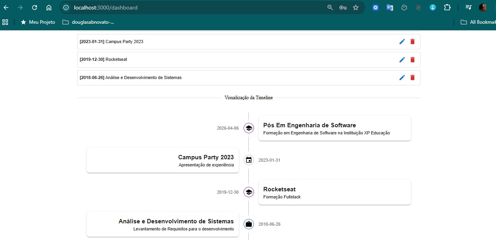

# Timeline App

Projeto de timeline da jornada profissional.

[proximo passo: conferir fluxo de tela, persistencia, compartilhamento de estado]

## ✅ Recursos Implementados

Recurso Status

- Login e Registro com validação ✅ Completo
- Persistência com localStorage ✅ Completo
- Controle de acesso por papel ✅ Completo
- Timeline visual com ícones ✅ Completo
- Formulário de eventos (admin) ✅ Completo
- Logout e redirecionamento ✅ Completo

## Projeto

Vamos desenvolver o nosso projeto de timeline para exibirmos para clientes.

### 📂 Arquivos organizados

- Componentes principais (login.jsx, register.jsx, dashboard.jsx)
- Contexto de autenticação (AuthContext.jsx)
- Serviço de armazenamento (storageService.js)
- Arquivo de rotas (App.jsx)
- Arquivo de entrada (main.jsx)
- Estrutura de pastas recomendada

### 📁 Estrutura de Pastas

```markdown
    src/
    ├── components/
    │   ├── Login.jsx
    │   ├── Register.jsx
    │   └── Dashboard.jsx
    ├── context/
    │   └── AuthContext.jsx
    ├── utils/
    │   └── storageService.js
    ├── App.jsx
    └── main.jsx
```

### Descrição

📂 context/AuthContext.jsx

- O que faz:

  - Cria um AuthProvider para centralizar login, registro e logout.
  - Armazena usuário atual no localStorage (currentUser).
  - Mantém lista de usuários em localStorage (users).

- Fluxo:

  - register(newUser) → adiciona no array users + faz login.
  - login(user) → salva no currentUser.
  - logout() → remove currentUser.

- Correção: está bem estruturado ✅. Ideal para mock.

📂 components/PrivateRoute.jsx

- O que faz:

  - Protege rotas sensíveis (/dashboard).
  - Se currentUser existe → mostra conteúdo.
  - Se não → redireciona para /login.

- Correção: sintaxe correta ✅, usa Navigate do React Router v6.

📂 pages/Login.jsx

- O que faz:

  - Formulário com email + senha.
  - Busca no localStorage dentro de users.
  - Se encontrar → chama login(user) → redireciona /dashboard.
  - Senão → alerta de erro.

- Correção: correto ✅, apenas lembre-se que password está em texto puro (aceitável para mock).

📂 pages/Register.jsx

- O que faz:

  - Formulário com nome, email, senha.
  - Antes de cadastrar → verifica se email já existe no localStorage.
  - Se não existir → cria newUser com Date.now() como ID.
  - Salva em users e já faz login automático.

- Correção: fluxo correto ✅, garante unicidade de email.

📂 pages/Dashboard.jsx (primeira versão)

- O que faz:

  - Exibe mensagem “Bem-vindo, {nome}”.
  - Mostra espaço para a Timeline.
  - Botão de logout → limpa sessão.

- Correção: correto ✅.

📂 components/TimelineComponent.jsx (versão dinâmica)

- O que faz:

  - Recebe lista events como prop.
  - Renderiza com Timeline do MUI Lab.
  - Ícone varia conforme type (work, course, event).

- Correção: bem implementado ✅, já preparado para dados externos.

📂 pages/Dashboard.jsx (versão com formulário + eventos)

- O que faz:

  - Carrega events do localStorage ao iniciar.
  - Formulário para adicionar evento (tipo, título, descrição, data).
  - Salva evento no localStorage e atualiza state.
  - Renderiza timeline dinâmica com TimelineComponent.

- Correção: fluxo completo ✅, persistência funcionando.

📂 App.jsx

- O que faz:

  - Define rotas /login, /register, /dashboard.
  - Usa PrivateRoute para proteger /dashboard.
  - Envolve tudo em AuthProvider.

- Correção: correto ✅, integra bem o contexto + rotas.

🔍 Resumo do Fluxo

- Registro → cria usuário no localStorage + login automático.
- Login → busca em localStorage + salva em currentUser.
- Sessão → AuthContext guarda estado e persiste com localStorage.
- Proteção → PrivateRoute bloqueia acesso sem login.
- Dashboard → mostra Timeline + permite logout.
- Timeline dinâmica → eventos adicionados via formulário, persistidos no localStorage.

⚠️ Observações Importantes

- Senha está em texto puro no localStorage → ok para mock, mas depois obrigatório usar hash no backend.
- Timeline salva tudo em localStorage global → se quiser eventos por usuário, precisará salvar em chave específica (events\_${userId}).
- Ao migrar para BD real → só trocar funções de login/register/events para bater no backend.

### Estrutura de pastas

Organização do projeto

```markdow
src/
 ├─ components/
 │   ├─ TimelineComponent.jsx
 │   └─ PrivateRoute.jsx
 ├─ context/
 │   └─ AuthContext.jsx
 ├─ pages/
 │   ├─ Dashboard.jsx
 │   ├─ Login.jsx
 │   └─ Register.jsx
 ├─ App.jsx
 └─ index.js
```

### Fluxo Completo: Login / Registro / Dashboard

```markdow
           ┌──────────────────────────┐
           │   Aplicação ReactJS      │
           └─────────────┬────────────┘
                         │
                Carrega AuthContext
                         │
        ┌────────────────┴───────────────┐
        │ Verifica se admin existe no LS │
        │   (se não, cria admin fixo)    │
        └────────────────┬───────────────┘
                         │
              Usuário acessa /login ou /register
                         │
        ┌───────────────┴───────────────┐
        │                               │
   [Login]                           [Register]
        │                               │
   Verifica email/senha             Verifica se email já existe
        │                               │
        │                          Bloqueia email do admin
        │                               │
        │                               │
   Se válido → salva                   Role = viewer
   currentUser no LS                     │
        │                               │
        └───────────────┬───────────────┘
                        Redireciona para /dashboard
                         │
          ┌──────────────┴───────────────┐
          │ Verifica role do currentUser │
          └──────────────┬───────────────┘
                         │
         ┌───────────────┴───────────────┐
         │                               │
     Role = "admin"                   Role = "viewer"
         │                               │
 ┌───────┴─────────┐            ┌────────┴─────────┐
 │ Dashboard Admin │            │ Dashboard Viewer │
 └─────────────────┘            └─────────────────┘
         │                               │
- Formulário adicionar eventos      - Apenas visualizar
- Lista timeline admin              - Timeline compartilhada (events_shared)
- Botão publicar evento para        - Sem botões de edição
  clientes
- CRUD completo de eventos
         │                               │
         └───────────────┬───────────────┘
                         │
                    Botão logout
                         │
                   Remove currentUser
                     Redireciona /
```

### Dois tipos de timeline:

    - Administração (privada) → só você acessa (CRUD completo: adicionar, editar, excluir).
    - Clientes (visualização) → usuários convidados entram com login/senha e só podem visualizar a timeline que você escolheu compartilhar.

🔹 Resumo Visual

- Admin

  - Login com email/senha fixo.
  - Pode criar, editar, remover eventos (events_admin).
  - Pode publicar eventos para clientes (events_shared).

- Clientes/Viewers

  - Login com email/senha registrados via formulário.
  - Apenas visualizam a timeline compartilhada (events_shared).

- Segurança básica
  - Nenhum cliente pode usar o email do admin.
  - Dashboard interpreta automaticamente o role do usuário.

🔹 Uma versão final do projeto completo em React, incluindo:

- AuthContext com admin fixo
- Register.jsx bloqueando admin
- Login.jsx
- Dashboard.jsx com roles e timelines separadas
- TimelineComponent.jsx dinâmica

## ✅ Checklist do Projeto React (Timeline App)

1. Criar o projeto

- Abrir o Git Bash
- Rodar:

```git bash
npx create-react-app timeline-app
cd timeline-app
```

- Iniciar repositório git

```git bash
git init
git add .
git commit -m "Início do projeto React"
```

2. Instalar dependências

- Material UI (componentes)

```git bash
npm install @mui/material @emotion/react @emotion/styled
```

- Material UI Icons

```git bash
npm install @mui/icons-material
```

- Material UI Lab (Timeline)

```git bash
npm install @mui/lab
```

- React Router

```git bash
npm install react-router-dom
```

3. Estrutura de pastas no src/

- Criar manualmente estas pastas e arquivos:

```markdown
src/
├─ components/
│ ├─ TimelineComponent.jsx
│ └─ PrivateRoute.jsx
├─ context/
│ └─ AuthContext.jsx
├─ pages/
│ ├─ Dashboard.jsx
│ ├─ Login.jsx
│ └─ Register.jsx
├─ App.jsx
└─ index.js
```

4. Implementar os arquivos

- context/AuthContext.jsx → autenticação, admin fixo, login/logout/register.
- pages/Register.jsx → registro de clientes (não permite admin).
- pages/Login.jsx → login admin ou clientes.
- pages/Dashboard.jsx →
  - Admin → CRUD de eventos + publicar para clientes.
  - Viewer → apenas ver timeline compartilhada.
- components/TimelineComponent.jsx → timeline dinâmica com eventos.
- components/PrivateRoute.jsx → rota protegida por login.
- App.jsx → configurar BrowserRouter e rotas.

5. Testar fluxo

- Rodar npm start e abrir http://localhost:3000.
- Criar login com admin fixo (admin@email.com / admin123).
- Testar registro de cliente → login → ver timeline compartilhada.
- Testar CRUD de eventos no admin e publicação para clientes.
- Validar logout → redireciona para login.

6. Versionamento

Fazer commit inicial com a estrutura pronta:

```git bash
git add .
git commit -m "Estrutura base com AuthContext, Pages e Components"
```

👉 Com esse checklist, no final terá o projeto 100% funcional na versão mock/localStorage.

## ✅ Análise do projeto

O projeto está bem estruturado e funcional: roles separados, timeline dinâmica, autenticação com localStorage e fluxo completo (login, registro, dashboard).

### ✅ Diagnóstico Atual

- Você já tem uma estrutura funcional com:
- Autenticação e registro usando localStorage
- Persistência do usuário logado (currentUser)
- Admin fixo com papel "admin" e controle de acesso
- Eventos pessoais e compartilhados salvos em localStorage
- Dashboard dinâmico com formulários e timelines
- Componentização limpa (TimelineComponent)

#### 🧩 Etapa 1: Aprimorar Persistência com localStorage - V1

##### 🔧 Melhorias sugeridas

1. Validação de dados🔧Validar campos antes de salvar (ex: datas válidas, títulos não vazios).
2. Evitar duplicações🔧Verificar se eventos com mesmo título/data já existem antes de adicionar.
3. Separar lógica de persistência🔧Criar um utilitário storageService.js para centralizar get, set, remove do localStorage.
4. Sincronizar estado global🔧Se quiser escalar, considerar usar useReducer ou zustand para gerenciar estado com persistência.
5. Feedback visual🔧Mostrar mensagens de sucesso/erro ao adicionar ou publicar eventos.

- 🧠 Por que sair do localStorage?
- Limitação do localStorage 🧠 Impacto
- Dados só existem no navegador 🧠 Não há compartilhamento entre usuários
- Sem autenticação real 🧠 Qualquer pessoa pode alterar dados via DevTools
- Sem controle de concorrência 🧠 Dois usuários podem sobrescrever dados
- Sem histórico ou logs 🧠 Não há rastreabilidade

#### 🗂️ Etapa 2: Persistência com Arquivo JSON - V2

##### 🛠️ Tecnologias sugeridas

- Node.js com fs ou lowdb
- Express para criar uma API REST simples
- JSON como banco de dados local (db.json)

- ✅ Estratégia: CRUD com JSON
- A ideia é usar um servidor local que manipula um arquivo db.json como se fosse um banco de dados.

- 🔧 Ferramentas recomendadas
- Ferramenta 🔧 Função
- json-server 🔧 Cria uma API REST completa em cima de um arquivo JSON
- Express + lowdb 🔧 Permite mais controle e lógica personalizada
- axios 🔧 Cliente HTTP para consumir a API no frontend

- 🔄 Operações CRUD
- Operação 🔄 Rota 🔄 Método
- Criar evento 🔄 /events 🔄 POST
- Listar eventos 🔄 /events 🔄 GET
- Atualizar evento 🔄 /events/:id 🔄 PUT
- Remover evento 🔄 /events/:id 🔄 DELETE
- Filtrar publicados 🔄 /events?public=true 🔄 GET

- 🧪 Testar localmente

Instalar o json-server:

```git bash
npm install -g json-server
```

Criar o arquivo db.json seguindo a estrutura crud:
Rodar o servidor:

```git bash
json-server --watch db.json --port 3001
```

No frontend, trocar chamadas ao storageService por axios:

```git bash
axios.get("http://localhost:3001/events")
axios.post("http://localhost:3001/events", newEvent)
```

- 🧱 Benefícios da abordagem JSON
- Simula um backend real sem precisar de banco de dados
- Permite múltiplos usuários e controle de acesso
- Facilita migração futura para Firebase, Supabase ou PostgreSQL
- Permite testes com ferramentas como Postman

- 📋 Migrar para uma versão com persistência via JSON

- 🧱 Etapa 1: Montar o db.json
- Esse arquivo será o “banco de dados” simulado.
- Ele conterá os dados de usuários e eventos que seu app vai consumir via API REST.
- 📄 Estrutura inicial recomendada:

```json
{
  "users": [
    {
      "id": "1",
      "name": "Administrador",
      "email": "douglasabnovato.developer@gmail.com",
      "password": "developer123",
      "role": "admin"
    }
  ],
  "events": [
    {
      "id": "101",
      "title": "Evento de exemplo",
      "description": "Descrição do evento",
      "date": "2025-08-18",
      "type": "event",
      "public": true,
      "owner": "Administrador"
    },
    {
      "id": "2765",
      "title": "Festa",
      "description": "networking",
      "date": "2022-01-18",
      "type": "event",
      "public": true,
      "owner": "Administrador"
    },
    {
      "id": "5dd3",
      "title": "Alura",
      "description": "Treinamento",
      "date": "2025-11-18",
      "type": "event",
      "public": true,
      "owner": "Administrador"
    }
  ]
}
```

- ✅ O que fazer agora:
- Criar um arquivo db.json na raiz do projeto (ou em uma pasta chamada api)
- Copiar a estrutura acima
- Salvar e manter esse arquivo como fonte de dados

- ⚙️ Etapa 2: Configurar o json-server
- O json-server transforma o db.json em uma API REST completa, sem precisar escrever backend.
- 🔧 Instalar o json-server:

```git bash
npm install -g json-server
```

- ▶️ Rodar o servidor:

```git bash
json-server --watch ./api/db.json --port 3001
```

- 🔗 Endpoints disponíveis:
- Recurso 🔗 Método 🔗URL
- Listar usuários 🔗 GET 🔗 http://localhost:3001/users
- Criar usuário 🔗 POST 🔗 http://localhost:3001/users
- Listar eventos 🔗 GET 🔗 http://localhost:3001/events
- Criar evento 🔗 POST 🔗 http://localhost:3001/events
- Atualizar evento 🔗 PUT 🔗 http://localhost:3001/events/:id
- Filtrar publicados 🔗 GET 🔗 http://localhost:3001/events?public=true
- Deletar evento 🔗 DEL http://localhost:3001/events/:id

- 🧪 Teste rápido no navegador
- Acesse: 🔗 http://localhost:3001/events
- Você deve ver os eventos em formato JSON.

- 🔄 Etapa 3: Refatorar o projeto para consumir essa API
- Agora vamos substituir o uso de localStorage por chamadas HTTP usando axios.

- 📦 Instalar axios:

```git bash
npm install axios
```

- 🧠 Refatorar serviços:
- Criar um arquivo eventService.js:

```javascript
import axios from "axios";

const API_URL = "http://localhost:3001/events";

export const eventService = {
  getAll: () => axios.get(API_URL),
  getPublic: () => axios.get(`${API_URL}?public=true`),
  create: (event) => axios.post(API_URL, event),
  update: (id, event) => axios.put(`${API_URL}/${id}`, event),
  delete: (id) => axios.delete(`${API_URL}/${id}`),
};
```

- Criar userService.js se quiser tratar login e registro via API.

- 🧩 Refatorar Dashboard.jsx:
- Substituir storageService.get("timelineEvents") por eventService.getAll()
- Substituir storageService.set(...) por eventService.create(...) ou update(...)
- Usar event.public para decidir se o evento aparece para o viewer

- ✅ Resultado Final
- Uma API REST local simulando um backend real
- Persistência de dados fora do navegador
- Separação clara entre frontend e backend
- Facilidade para escalar para Firebase, Supabase ou Express

##### 📋 Plano de ação

1. Criar backend local🔧Inicializar projeto Node.js com express e lowdb para manipular db.json.
2. Estrutura do JSON🔧Criar db.json com seções: users, events_admin, events_shared.
3. Rotas REST🔧Criar rotas: POST /login, POST /register, GET /events, POST /events, PUT /events/:id, DELETE /events/:id.
4. Integração com frontend🔧Substituir chamadas ao localStorage por fetch ou axios para consumir a API.
5. Persistência real🔧Toda alteração (registro, login, eventos) será salva no db.json, garantindo persistência mesmo após reiniciar o app.
6. Autenticação básica🔧Implementar verificação de credenciais no backend (sem JWT por enquanto).
7. Controle de acesso🔧Validar papel do usuário (admin ou viewer) nas rotas de criação/publicação.

Vou analisar em duas partes:

### 📌 Descrição das etapas já implementadas

1. 🚀 AuthContext

- Cria um contexto global para autenticação.
- Admin fixo é inserido automaticamente no localStorage se não existir.
- Mantém o estado currentUser em memória + localStorage.
- Fornece funções: login, logout e register.

2. 🚀 Register

- Formulário Material UI para cadastro.
- Impede usar o email do admin.
- Verifica duplicidade de email.
- Cadastra novo usuário com role = "viewer".
- Após registrar → faz login automático e redireciona para dashboard.

3. 🚀 Login

- Formulário Material UI para login.
- Valida contra users no localStorage.
- Se sucesso → chama login e redireciona para dashboard.
- Se erro → alerta simples.

4. 🚀 PrivateRoute

- Protege as rotas privadas.
- Se não logado → redireciona para /login.

5. 🚀 TimelineComponent

- Implementa timeline dinâmica com @mui/lab.
- Ícones mudam de acordo com o tipo (work, course, event).
- Layout alternado (esquerda/direita).

6. 🚀 Dashboard

Usa currentUser.role para decidir o layout:

- Admin → - Adiciona eventos - Mantém timeline própria (events_admin) - Pode publicar eventos para clientes (events_shared)
- Viewer → - Só visualiza events_shared. - Persistência feita em localStorage (events_admin, events_shared).

7. 🚀 App

- Define rotas: /login, /register, /dashboard.
- Usa PrivateRoute para proteger /dashboard.
- Catch-all → /login.

### 🔎 Testar Projeto

#### 🛠 Passos para testar localStorage

- Alterar o useState de adminEvents e sharedEvents para carregar do localStorage.
- Remover o primeiro useEffect que só carregava os dados.
- Testar fluxo:
  - Logar como admin
  - Criar eventos → dar refresh → verificar se aparecem
  - Publicar para clientes → logar como viewer → refresh → verificar se timeline persiste.

#### 🛠 Passos para testar publicar

- Transformar esses botões em “toggle buttons”:

  - Quando não publicado → aparece como não marcado.
  - Quando publicado → aparece como marcado (exemplo: cor diferente ou preenchido).
  - Se clicar de novo → remove da timeline compartilhada e volta para o estado original.

- 🔎 Estratégia

- Hoje, handlePublishToClients(ev) só adiciona o evento em sharedEvents.
- Precisamos que ele verifique se o evento já está publicado:
  - Se já está em sharedEvents → remove.
  - Se não está em sharedEvents → adiciona.
- Para estilização, o botão deve mudar de cor conforme o estado.

  - Publicado → variant="contained", cor success.
  - Não publicado → variant="outlined", cor primary.

- 📌 O que mudou

- Criamos handleTogglePublish para adicionar ou remover do sharedEvents.
- Verificação com sharedEvents.some(...) → vê se o evento já foi publicado.
- Cada botão agora muda de visual conforme o estado:
  - Publicado → variant="contained", cor verde (success).
  - Não publicado → variant="outlined", cor azul (primary).
- Texto também muda dinamicamente (Publicado: ... ou Publicar: ...).

#### 🧪 Passos para testar fluxos

- Depois de aplicar o storageService, teste:

- ✅ Registro de novo usuário
- ✅ Login com usuário existente
- ✅ Login com admin
- ✅ Adição de eventos
- ✅ Publicação e remoção de eventos compartilhados
- ✅ Logout e persistência após reload

### 📌 Possíveis melhorias

#### 🔐 Segurança / Autenticação

- Senhas estão salvas em texto puro no localStorage → ideal seria hash (ex: bcryptjs).
- LocalStorage pode ser manipulado manualmente → em produção migrar para backend com JWT.
- Adicionar expiração de sessão ou botão "lembrar-me".

#### 🎨 UX/UI

- Alertas podem ser substituídos por MUI Snackbar (mais moderno).
- Adicionar feedback visual após login/logout/registro.
- Melhorar formulário de eventos com DatePicker em vez de campo texto "Ano".

#### ⚡ Código / Estrutura

- Centralizar chaves do localStorage (users, events_admin, events_shared) em um util/helper → evitar repetição.
- Criar hook customizado useEvents para encapsular lógica de CRUD/persistência de eventos.
- Tipar melhor os eventos (id, type, title, description, date) → até com TypeScript futuramente.

#### 👥 Gestão de Usuários

- Permitir que o admin visualize a lista de clientes cadastrados.
- Opção para admin remover cliente ou redefinir senha.
- Permitir que admin escolha quais eventos vão para quais clientes (hoje todos compartilham a mesma timeline).

#### 📊 Escalabilidade

- Hoje todos os clientes veem a mesma timeline compartilhada.
- Futuro: cada cliente poderia ter timeline personalizada.
- Migrar dados de localStorage para um backend (Node.js + MongoDB/Postgres).
- Criar API REST ou GraphQL para lidar com autenticação e eventos.

### 📌 Resumo

👉 O que você já tem é ótimo para MVP (demonstração funcional).
👉 Se for só demo local → basta polir UX e mensagens.
👉 Se quiser colocar em produção → migrar login/events para backend com segurança real.

### 🧠 Sugestões Extras

#### 🔐 Criptografar senhas

- Mesmo em ambiente local, usar bcrypt para não salvar senhas em texto plano.

#### 🧪 Testes manuais

- Criar cenários de teste para login, registro, publicação e visualização.

#### 📦 Futuro com banco real

- Quando quiser escalar, migrar para MongoDB ou SQLite será natural.

#### 🧱 Separar camadas

- Backend com rotas e serviços separados, frontend com hooks e contextos organizados.

#### 👉 Backend

- Começar o backend com lowdb e Express, ou montar o storageService.js para melhorar o uso do localStorage.

#### 🔧 Feedback visual

- usar Snackbar do Material UI para mostrar mensagens de sucesso/erro em vez de alert.

#### 🔧 Organização futura

- Para escalar ainda mais:
  - Criar eventService.js para lidar com eventos
  - Criar userService.js para lidar com usuários
  - Usar useReducer ou zustand para gerenciar estado com persistência automática

### evoluir esse projeto com:

- 🔍 Filtros por tipo, data ou palavra-chave
- 🗑️ Remoção ou edição de eventos
- 🧑‍💼 Painel separado para clientes
- ☁️ Persistência em backend (Firebase, Supabase, etc.)
- 📱 Versão mobile com layout responsivo

## Testar Aplicação

Testa tranquilo a aplicação com esse fluxo:

- Iniciar JSON Server
````git
npx json-server --watch db.json --port 3001
````

- Rodar React
````git
npm start
````

- Fluxo de teste
  - Registrar um usuário → login.
  - Criar alguns eventos (com datas e tipos diferentes).
  - Verificar se aparecem na lista + timeline.
  - Atualizar a página (os eventos devem persistir, pois estão no db.json).
  - Editar e deletar para validar CRUD.

### 📋 Plano de Ação: Desenvolvimento da Timeline App

Fase 1: Infraestrutura de Acesso e Segurança

- [x] src/pages/Login.jsx: Desenvolvimento da interface de login que consome a função login do seu contexto e trata erros de credenciais.
- [x] src/pages/Register.jsx: Desenvolvimento do formulário de cadastro, garantindo que novos usuários sejam salvos no db.json via API.
- [x] src/components/PrivateRoute.jsx: Implementação do componente que protege o Dashboard, impedindo acessos de usuários não autenticados.
- [x] src/App.js: Configuração das rotas (BrowserRouter) e proteção das páginas privadas, unindo os componentes acima.

Fase 2: O Coração da Aplicação (Timeline)

- [x] src/components/TimelineComponent.jsx: Criação da visualização gráfica usando Material UI Lab, tornando-a capaz de renderizar diferentes tipos de ícones (trabalho, estudo, etc.).
- [x] src/pages/Dashboard.jsx: Implementação da lógica de visualização 
- [x] Admin: Carrega todos os eventos + Formulário de criação.
- [x] Viewer: Carrega apenas eventos marcados como públicos.

- 
- 
- 
- 

Fase 3: Refinamento e Funcionalidades Avançadas

- [x] src/pages/Dashboard.jsx (Refatoração): Adição das funções de Editar, Excluir e o botão Toggle (Publicar/Privado).
- [x] src/pages/Home.jsx: Ajuste final na página inicial para redirecionar usuários já logados diretamente para o Dashboard.

#### 📋Testes 

1. Ligue o Servidor de Dados
- Abra um novo terminal (mantenha o do React rodando) e execute:
- npx json-server --watch db.json --port 3001

2. User Admin
- Douglas Admin
- admin@email.com
- 123

3. User Visitante
- Visitante-A
- visitante-a@email.com
- a@email

### 📋 QA

- Padding nas páginas

@douglasabnovato